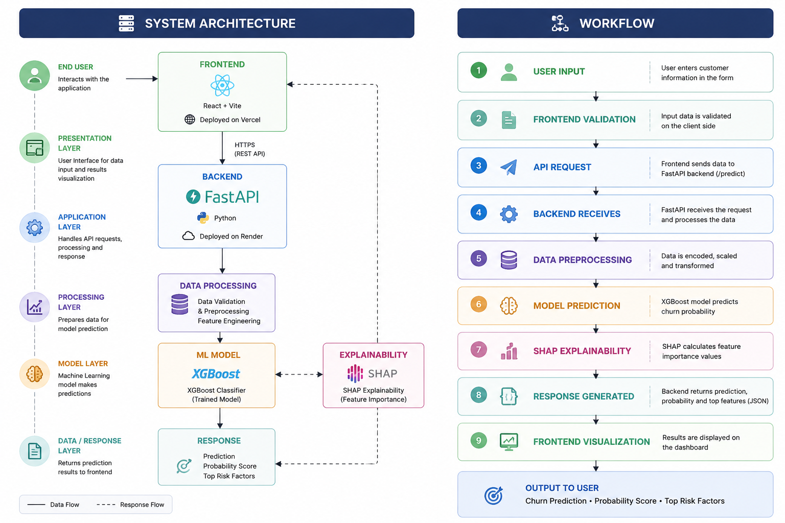
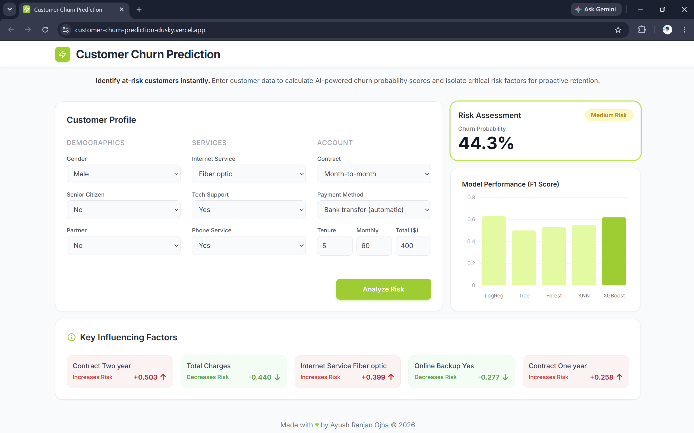

# 📊 Customer Churn Prediction System

An end-to-end Machine Learning application that predicts whether a customer is likely to churn based on subscription details, service usage patterns, and billing information. The system provides real-time predictions and explainable AI insights using SHAP to highlight the factors influencing each prediction.

🌐 **Live Demo:** https://customer-churn-prediction-dusky.vercel.app

---

## 🚀 Highlights

* Real-Time Customer Churn Prediction
* XGBoost-Based Classification Model
* SHAP-Powered Explainable AI
* Interactive React Dashboard
* FastAPI REST Backend
* Dockerized Deployment
* CI/CD with GitHub Actions
* Cloud Deployment on Vercel & Render
* Responsive User Interface

---

## 📌 Overview

Customer retention is a critical business challenge. This project leverages Machine Learning and Explainable AI to identify customers who are likely to leave a service and provides transparency into the model's predictions.

Users can enter customer details through a modern web interface and instantly receive:

* Churn Prediction (Yes / No)
* Churn Probability Score
* Risk Assessment
* Top Contributing Features
* SHAP-Based Explainability Insights

---

## ✨ Features

### 🤖 Machine Learning

* Multiple Model Evaluation
* Logistic Regression
* Decision Tree
* Random Forest
* K-Nearest Neighbors (KNN)
* XGBoost (Final Model)
* Probability-Based Predictions

### 🧠 Explainable AI

* SHAP Feature Importance Analysis
* Top Feature Contribution Display
* Transparent Model Predictions

### 💻 Application Features

* Real-Time Predictions
* Interactive Dashboard
* RESTful API Architecture
* Responsive Design
* Cloud Deployment Support

### ⚙️ DevOps

* Dockerized Backend
* GitHub Actions CI/CD Pipeline
* Production Deployment Configuration

---

## 🛠️ Tech Stack

### Frontend

* React.js
* Vite
* Axios
* Recharts
* CSS3

### Backend

* FastAPI
* Python
* Uvicorn

### Machine Learning

* XGBoost
* Scikit-Learn
* Pandas
* NumPy
* SHAP

### DevOps & Deployment

* Docker
* GitHub Actions
* Render
* Vercel
* GitHub

---

## 🏗️ System Architecture



### Architecture Flow

```text
User
 ↓
React Frontend
 ↓
FastAPI Backend
 ↓
XGBoost Model
 ↓
Prediction + SHAP Analysis
```

---

## 📸 Application Screenshot

### Customer Churn Prediction Dashboard



---

## 📂 Project Structure

```text
Customer-Churn-Prediction/
│
├── backend/
│   ├── main.py
│   ├── utils.py
│   ├── model.pkl
│   ├── columns.pkl
│   ├── requirements.txt
│   └── Dockerfile
│
├── frontend/
│   ├── src/
│   ├── public/
│   ├── package.json
│   └── vite.config.js
│
├── ml/
│   └── notebooks/
│
├── data/
│
├── screenshots/
│   ├── main.png
│   └── sys-arch.png
│
├── .github/
│   └── workflows/
│
└── README.md
```

---

## 🚀 Local Setup

### Clone Repository

```bash
git clone <repository-url>

cd Customer-Churn-Prediction
```

### Backend Setup

```bash
cd backend

pip install -r requirements.txt

uvicorn main:app --reload
```

Backend runs on:

```text
http://127.0.0.1:8000
```

### Frontend Setup

```bash
cd frontend

npm install

npm run dev
```

Frontend runs on:

```text
http://localhost:5173
```

---

## 📡 API Endpoint

### Predict Customer Churn

**POST** `/predict`

### Sample Response

```json
{
  "prediction": 1,
  "probability": 0.7568,
  "top_features": [
    {
      "feature": "Contract_Two year",
      "impact": 0.5069
    }
  ]
}
```

---

## 📈 Model Information

### Final Model

* XGBoost Classifier

### Explainability Framework

* SHAP (SHapley Additive Explanations)

### Evaluation Metrics

* Accuracy
* Precision
* Recall
* F1 Score

---

## 🔒 Key Engineering Components

* FastAPI-Based Inference Service
* XGBoost Classification Pipeline
* SHAP Explainability Integration
* Dockerized Backend Deployment
* GitHub Actions CI/CD Workflow
* Frontend–Backend API Communication
* Cloud-Native Deployment Architecture

---

## 🔮 Future Enhancements

* Prediction History Tracking
* Batch Prediction via CSV Upload
* Model Monitoring & Drift Detection
* Automated Retraining Pipeline
* Business Analytics Dashboard
* Prediction Report Export (PDF/Excel)
* MLOps Integration

---

## 👨‍💻 Author

**Ayush Ranjan Ojha**

* GitHub: https://github.com/ayushojha0405

---

## ⭐ Acknowledgements

* FastAPI
* React
* XGBoost
* SHAP
* GitHub Actions
* Docker
* Render
* Vercel
